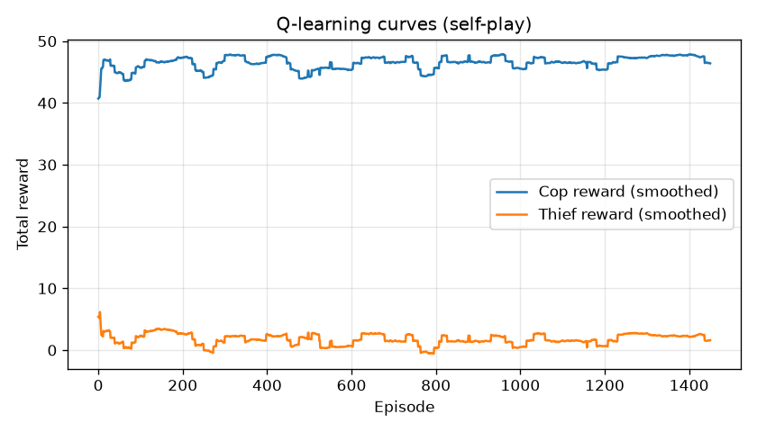
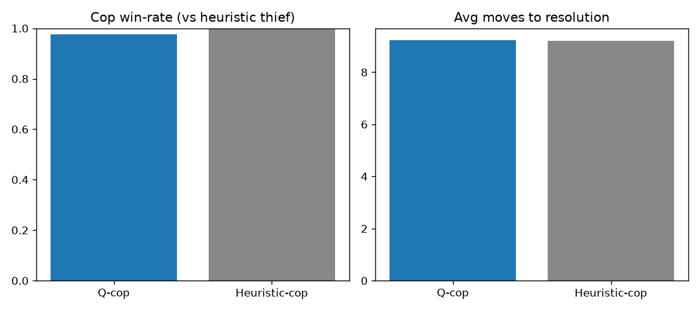
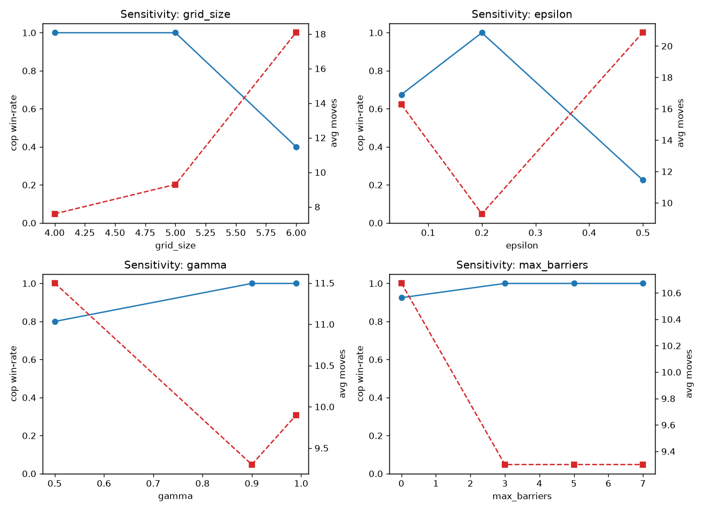
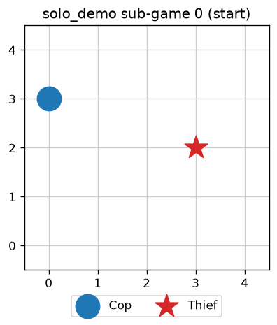
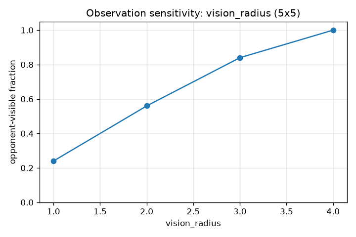
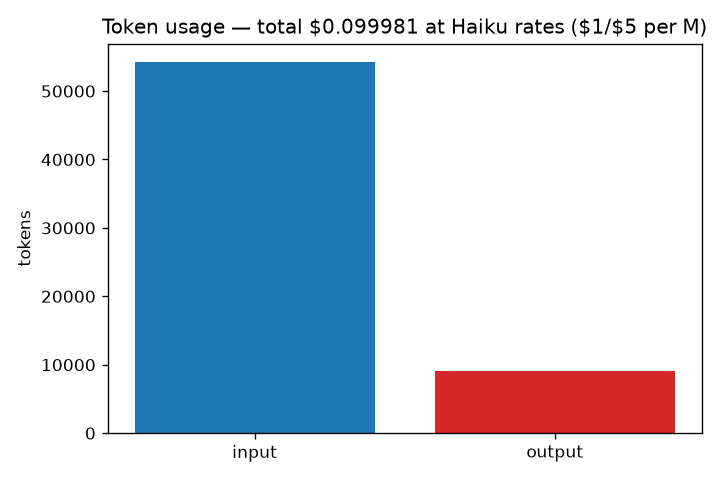

# robocopMCP — Dual AI Agent Pursuit Race over MCP

> **Group `il-nv-ai`** · Ilya Lazarev (212177943) · Nadav Goldin (316350768)
> Course **EX06** — "Dual AI Agent Race via MCP Servers", Prof. Yoram Segal
> Repo: <https://github.com/ilyalaz01/robocopMCP> · License: MIT

Two autonomous AI agents — a **Cop** and a **Thief** — play a partially-observable
pursuit game on a grid. They **communicate in free natural language** over **two MCP
servers** (one per role, HTTP), **negotiate their own match rules** before playing, and the
Cop **emails a structured JSON report** at the end. Movement strategy is learned with
**tabular Q-learning**; language and negotiation are driven by **Claude Haiku**. Every
external call passes through a centralized **API Gatekeeper**, and **everything is logged**.

---

## 1. Formal model — Dec-POMDP

The pursuit is a Decentralized Partially-Observable Markov Decision Process
`⟨ n, S, {Aᵢ}, P, R, {Ωᵢ}, O, γ ⟩`:

| Symbol | Meaning in robocopMCP |
| --- | --- |
| **n** | `2` agents — `i ∈ {cop, thief}`. |
| **S** | State = `(cop_cell, thief_cell, barriers ⊆ cells, move_count, turn)` on a `W×H` grid (config). |
| **Aᵢ** | `cop`: 8 king-moves + `STAY` + `PLACE_BARRIER`; `thief`: 8 king-moves (the Thief may **not** `STAY` — it must evade). |
| **P** | Deterministic transition: a validated move shifts the mover one cell; a barrier marks the Cop's cell impassable to the Thief and forfeits the move. Illegal claims are rejected (no state change). Turn order is **Thief → Cop**. |
| **R** | `cop`: `−1` per step, `+50` on capture. `thief`: `+1` per surviving step, `−50` on capture, `+50` on surviving to `max_moves`. Game scores (for the report): cop_win → 20/5, thief_win → 5/10. |
| **Ωᵢ** | Observation = cells within **Chebyshev radius `vision_radius`** of the agent: own cell, visible barriers, and the opponent's cell **only if inside that window**. |
| **O** | Deterministic observation function: the opponent is observed iff `chebyshev(self, opp) ≤ vision_radius`; otherwise its position must be **inferred from natural-language messages**. |
| **γ** | Discount `0.9` (config) for the Q-learning Bellman update. |

**Bellman update** (tabular, ε-greedy with decay):
`Q(s,a) ← Q(s,a) + α·[ r + γ·maxₐ′ Q(s′,a′) − Q(s,a) ]`. State is encoded as the clamped
relative displacement `(dx, dy)` to the believed opponent, keeping the table small and
board-size agnostic. See `docs/PRD_q_learning.md`.

---

## 2. The orchestration challenge (the point of the exercise)

The agents have **no fixed wire protocol for intent** — they coordinate through *free text*
that may be honest or deceptive. The system addresses the resulting challenges:

- **Free natural-language communication over MCP.** The LLM lives only in the orchestrator
  (the MCP *client*); the two FastMCP servers expose **tools**, never a model. Each turn the
  active agent's Haiku call produces a message (`send_message`) and the Q-table supplies the
  move (`suggest_move` → `move`) — *language and movement do not fight* (SPEC §5).
- **Ambiguity & deception (solo profile).** The Thief is explicitly prompted to **bluff**
  about its position; the receiver runs an LLM **interpreter** that maps the message to a
  coarse belief (`NORTH/SOUTH/.../UNKNOWN`), logged each turn. Real excerpt
  (`results/solo_demo/transcript.md`):

  > **thief**: "Ha! You'll never catch me, copper—I'm heading straight for the docks!"
  > **cop**: "I'm cutting northeast to head them off at the docks before they reach the water."
  > **thief**: "The docks? How predictable! I'm already halfway to the warehouse district…"

- **Mutual understanding without a referee.** Authoritative state lives in one
  `GameSession`; every `move()` is **re-validated** server-side ("mutual position
  verification") so neither side can desync. `match_digest()` lets either side cross-check.
- **Rule negotiation (constrained).** Before play, the agents argue in natural language over
  **only** the two negotiable parameters — `max_barriers ∈ 3..8` and `max_moves ∈ {25,30}`
  (they may never invent undefined rules) — and reach **explicit mutual confirmation**. Our
  persona proposes its own rules, argues briefly, and **concedes gracefully** after
  `max_rounds` (never deadlocks). Real dialogue: `results/solo_demo/negotiation.md`.
- **Never hangs.** Every LLM call has a timeout and a **deterministic fallback**; every
  fallback, retry, and queue event is logged.

### Peer-to-peer trust & verifiability (why the bonus profile exists)

A single system can own the truth, so the solo submission is a genuine **Dec-POMDP**:
partial observation + deception. But **two independent systems cannot agree on an identical
result under hidden state + lying** — with no trusted referee, either peer could misreport a
position it alone can see. The only ways to make such a match verifiable are (a) a **trusted
host** that owns the authoritative state, or (b) a **cryptographic commit-reveal / ZKP**
scheme where each side commits to its move before reveal. Both are heavyweight.

The clean alternative — and what both teams agreed (`_build/SHARED_RULES.md`) — is **open
information + truthful messages**: with the full board visible and no bluffing, there is no
hidden state to lie about, so a single **host-authoritative `GameSession`** plus per-turn
`match_digest()` cross-checks is sufficient for both teams to compute and email the
**byte-identical** bonus JSON. This is the **bonus profile**. See `docs/adr/0002-state-sharing.md`.

**Two profiles** (`docs/adr/0003-config-profiles.md`), selected by `--profile` / `ROBOCOP_PROFILE`:

| Profile | Visibility | Deception | Starts | Use |
| --- | --- | --- | --- | --- |
| `solo` (default) | partial (`vision_radius=1`) | allowed (bluffing) | `seeded_random` (seed 42) | the mandatory Dec-POMDP submission |
| `bonus` | **full** (open info) | **off** (truthful) | `fixed_pairs` (SHARED_RULES) | the host-authoritative inter-team match |

Architecture (C4 + ADRs): `docs/PLAN.md`. The orchestrator is parameterized by two server
URLs, so the same code runs locally or against another team's servers for the bonus.

---

## 3. Results & visualizations

A full **negotiated 6-sub-game series with real Haiku** (`scripts/run_demo.py`) produces the
artifacts under `results/solo_demo/` (solo profile) and `results/bonus_demo/` (bonus profile)
— transcript, negotiation, board PNGs, run summary, and the dry-run report — at a few cents
total (tokens logged). With **varied per-sub-game starts** the six games now genuinely differ
(distinct trajectories, and a mix of cop and thief wins) instead of the same game replayed
six times. The `bonus_demo` transcript shows **truthful** messages under full visibility.

| Learning curves | Q vs heuristic | Parameter sensitivity |
| --- | --- | --- |
|  |  |  |

| Board screenshot (no GUI) | Observation sensitivity | Token cost |
| --- | --- | --- |
|  |  |  |

**Key findings** (notebook `notebooks/analysis.ipynb`, rubric §8/§10):
- Cop win-rate falls **1.0 → 0.4** as the grid grows 4→6 — the Thief evades more on larger
  boards; capture takes longer.
- Exploration **ε ≈ 0.2** is optimal; barriers and higher **γ** favour the Cop.
- Larger `vision_radius` raises observability, reducing reliance on the language channel.
- API cost is **near-zero** (Haiku, ~150 tokens/turn) — see the token-cost figure.

**Proof of real MCP communication** — a slice of `results/solo_demo/events.jsonl`
(244 `tool_call`, 54 `state`, 48 `turn` events for one series):

```json
{"event":"tool_call","role":"thief","tool":"send_message","session_id":"solo_demo-sg0", ...}
{"event":"tool_call","role":"thief","tool":"move","direction":"S","ok":true, ...}
{"event":"api_call","service":"anthropic","input_tokens":122,"output_tokens":31, ...}
```

---

## 4. Installation

Requirements: Python ≥ 3.10 and **[uv](https://docs.astral.sh/uv/)** (the only package
manager — `pip`/`venv` are not used).

```bash
uv sync                       # create the env + install from pyproject/uv.lock
cp .env-example .env          # then put your key in .env: ANTHROPIC_API_KEY=sk-ant-...
```

The key is loaded process-locally via `python-dotenv`; `.env` and any key file are
git-ignored. Tests mock the API and need no key.

**Troubleshooting:** if `ANTHROPIC_API_KEY` is missing, language/negotiation fall back to
deterministic templates (logged as `llm_fallback`) and the pipeline still completes.

## 5. Usage

```bash
uv run robocop --check-config           # validate the versioned config files
uv run robocop --play                   # solo profile: 6 varied sub-games over MCP (no LLM)
uv run robocop --play --profile bonus   # bonus profile: full visibility, fixed start pairs
uv run python scripts/run_demo.py        # solo: negotiated series with REAL Haiku + artifacts
uv run python scripts/run_demo.py bonus  # bonus: full-visibility / truthful series + artifacts
uv run python -m robocop_mcp.mcp.cop_server     # start the Cop MCP server (:8001)
uv run python -m robocop_mcp.mcp.thief_server   # start the Thief MCP server (:8002)
uv run pytest                           # tests + coverage (≥ 85%)
uv run ruff check .                     # lint (0 errors)
```

All logic is reached through the **SDK** (`robocop_mcp.sdk.sdk.MarlSDK`):

```python
from robocop_mcp.sdk.sdk import MarlSDK
sdk = MarlSDK()
sdk.negotiate(stance="agree")                 # natural-language rule negotiation
series = sdk.run_series()                      # play (Q-table moves; LLM optional)
report = sdk.build_internal_report(series)     # exact-schema JSON
sdk.send_report(series, dry_run=True)          # Cop emails it (dry-run writes results/)
```

## 6. Configuration

Versioned JSON under `config/` (the **only** source of tunable values; `"version":"1.00"`
is validated at load):

| File | Controls |
| --- | --- |
| `config/config.json` | grid size, max moves, num games, barriers, vision radius, scoring, LLM model, negotiation bounds, Q-learning hyperparameters, server host/ports + token, report recipient/timezone. |
| `config/rate_limits.json` | per-service gatekeeper limits (rpm/rph, concurrency, retries, queue depth). |
| `config/logging_config.json` | log directory, level, JSONL event file. |

The MCP token is read env-first (`ROBOCOP_MCP_TOKEN`) and is **revocable** — rotate it to
reject old clients.

## 7. Examples

- **Negotiation transcript:** `results/solo_demo/negotiation.md`
- **Gameplay transcript (with bluffs + beliefs):** `results/solo_demo/transcript.md`
- **Board screenshots:** `results/solo_demo/sg*_start.png`, `sg*_end.png`
- **Run summary + token cost:** `results/solo_demo/summary.md`
- **Report (dry-run):** `results/solo_demo/report_internal.json`

## 8. Project structure

```
src/robocop_mcp/{domain,mcp,orchestrator,agents,learning,reporting,sdk,shared}
tests/{unit,integration}   docs/{PRD,PLAN,TODO,PRD_*,PROMPTS_LOG,adr}
config/   results/   assets/   notebooks/   scripts/
```

See `docs/` for the PRD, the C4 architecture + ADRs (`PLAN.md`), per-mechanism PRDs, and the
Prompt Engineering Log.

## 9. Contributing

Style: ruff (`E,F,W,I,N,UP,B,C4,SIM`), **0 errors**; every code file **≤ 150 lines**;
**TDD** with all external deps mocked; coverage **≥ 85%**; **uv** only. Run the Verification
Gate (`ruff check .` + `pytest --cov`) before every commit.

## 10. License & credits

MIT (`LICENSE`). Built with FastMCP, Anthropic Claude Haiku, NumPy, Matplotlib,
google-api-python-client, python-dotenv, pytest, and ruff — managed with uv. Game and rubric
by Prof. Yoram Segal.
